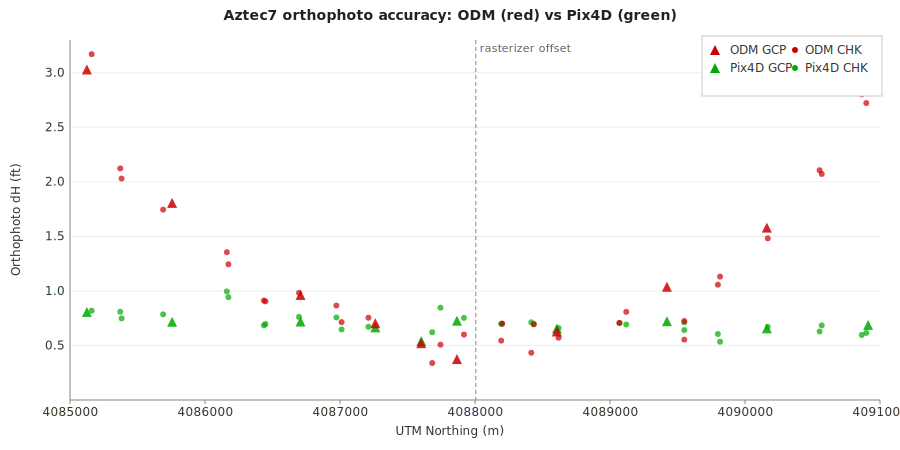
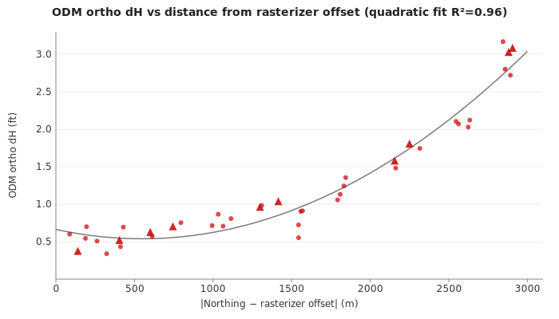
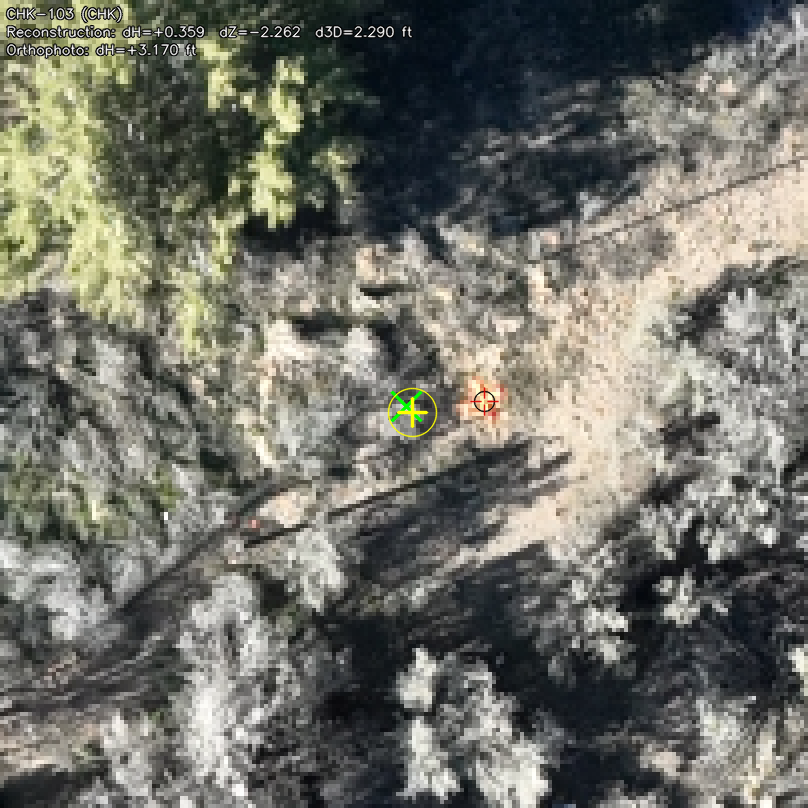
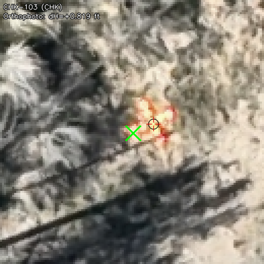
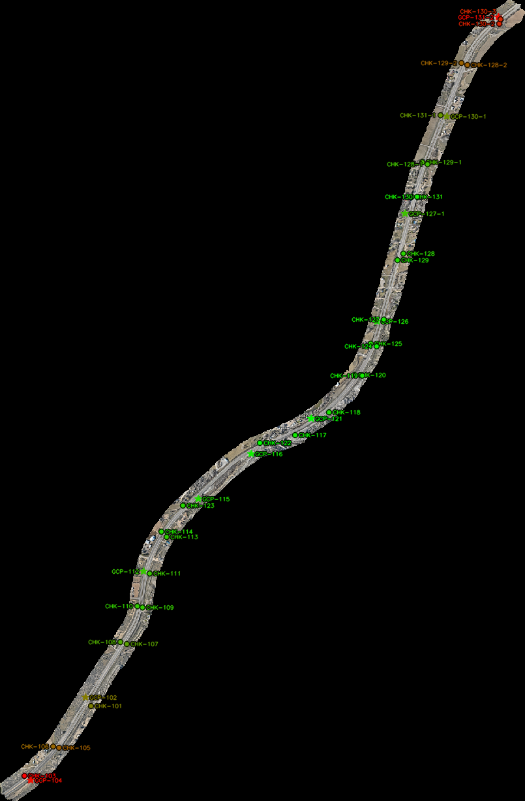
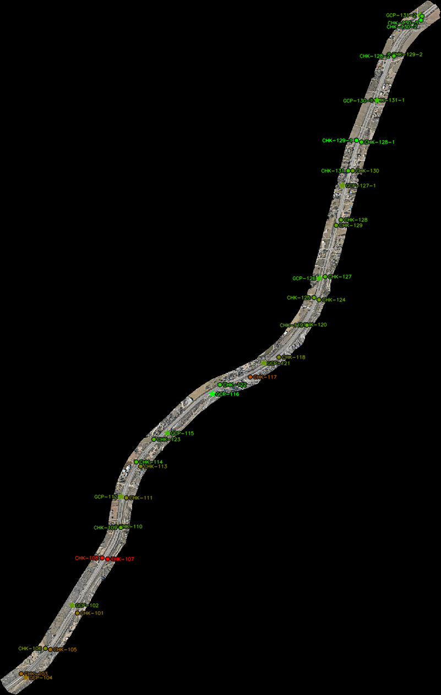
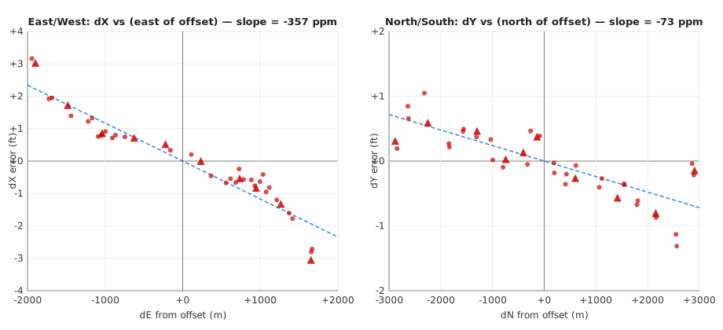

# ODM orthophoto error — aztec7 corridor investigation

**Status:** Pattern identified, attributable to known ODM upstream bug
(geo-hx6). Two complementary correction paths identified: per-job Helmert
(geo-7k57, cheap) and proper geodetic reproj of source data (geo-awe,
exact but expensive).

## Summary

On the aztec7 survey (6 km highway corridor, 1385 images, excellent reconstruction),
the ODM orthophoto shows a systematic U-shaped accuracy error along the corridor:
dH grows from ~0.3 ft at the center to over 3 ft at both ends. The same survey
rendered through Pix4D shows a flat ~0.65 ft dH across the entire corridor.

**ODM ortho dH correlates almost perfectly with |northing − `utm_north_offset`|
(where `utm_north_offset=4088006` is the internal coordinate offset ODM's
rasterizer uses): r=0.91 linear, R²=0.96 quadratic.**

This correlation is insensitive to camera count, terrain, flight height, and
reconstruction geometry — all of which are uniform or well-constrained.

## The numbers

| Metric | ODM | Pix4D |
|---|---|---|
| GCP RMS_H | **1.66 ft** | **0.68 ft** |
| CHK RMS_H | **1.42 ft** | **0.72 ft** |
| CHK range | 0.10–0.99 ft (10× spread) | 0.53–0.99 ft (2× spread) |
| Reconstruction GCP RMS_H | 0.020 ft (excellent) | — |
| Reconstruction CHK RMS_H | 0.240 ft (good) | — |

ODM's 3D reconstruction is outstanding. The error is introduced during ortho rendering.

## Visual comparison — worst point (CHK-103, south end)

Both reports crop the same 10 ft × 10 ft patch around the surveyed target location.
The green X marks the GNSS survey coordinate; the red crosshair is where the target
was tagged in the orthophoto. The gap between them is the ortho positioning error.

**ODM** — target visibly displaced from its surveyed position (3.17 ft dH):

**Pix4D** — target within ~0.8 ft of surveyed position:

## Overview maps

Targets colored green (best) to red (worst). Pix4D is uniform green. ODM degrades
to red at both corridor ends.

| ODM | Pix4D |
|---|---|
|  |  |

## Hypotheses considered

### 1. Radial lens distortion / low image overlap at ends ❌

*Premise*: corridor ends have fewer images per target; residual lens distortion
is strongest at image edges, so targets seen only through edge-of-frame pixels
would have larger positioning error.

**Ruled out by image count correlation.** `r(N_images, ortho_dH) = -0.10`.
Image count range across all 41 points is 11–21. Worst point (CHK-103 at
south end, dH=3.17 ft) has 18 images — more than the best point (CHK-122,
dH=0.34 ft) with 16 images. GCP-104 and CHK-119 both have 11 images but
dH of 3.02 ft vs 0.54 ft. Image count explains nothing.

QGIS inspection also confirmed that camera positions extend ~2× beyond the
southernmost target in both directions, so the worst points are *not* at the
coverage boundary.

### 2. SfM bowl / DEM elevation bias ❌

*Premise*: corridor SfM geometry is weak along-track (narrow baseline between
consecutive images vs. cross-track). Bundle adjustment could produce a
quadratic elevation drift at the corridor ends. A biased DEM would then cause
horizontal ortho displacement when imagery is draped onto it.

**Ruled out by reconstruction dZ data.** `r(dZ, ortho_dH) = 0.15` (no correlation).

More decisively, **GCP dZ is flat across the entire corridor**: ±0.065 ft on
every single GCP from south to north. The bundle adjustment nailed elevation
perfectly. There is no bowl.

CHK dZ has noise (stdev 2.2 ft) but it's scatter, not a systematic spatial
pattern. CHK-109 has dZ=+3.5 ft with ortho_dH=0.9 ft, while GCP-131-2 has
dZ=-0.06 ft with ortho_dH=3.1 ft. Elevation error does not drive ortho error.

### 3. Drone AGL variation over sloping terrain ❌

*Premise*: DJI flight planning commonly uses constant MSL altitude (altitude
above takeoff). On sloping terrain, actual AGL varies with terrain elevation.
If the mission was planned assuming 250 ft AGL at the center, both corridor
ends could be at a different AGL, affecting GSD and reprojection.

**Ruled out by terrain + camera altitude data.**
- Corridor terrain rises 10 m (33 ft) from south to north — monotonic, not U-shaped.
- Camera GPS altitude rises 12 m from south to north — the pilot stepped up with
  the terrain.
- Actual AGL: **210–220 ft, consistent ±12 ft across the entire corridor**.
- `r(AGL, ortho_dH) = -0.21` — no meaningful correlation.

A monotonic terrain slope cannot produce a symmetric U-shaped error, and the
pilot kept AGL uniform anyway.

### 4. Mesh quality degraded at corridor ends ❌

*Premise*: ODM renders the ortho by texturing and then rasterizing the 2.5D mesh.
Sparse vertices or degenerate triangles at the corridor ends could stretch
textures and displace pixels.

**Ruled out by mesh inspection.** The 2.5D mesh (200,718 vertices, 399,961 faces)
has fairly uniform vertex density along the corridor — south 10% of vertices
(14,893), center 10% (29,882, wider section), north 10% (17,116). No dramatic
falloff. Nothing visibly degraded at the ends.

### 5. Camera selection bias in texturing ❌

*Premise*: `mvs-texturing` uses `Data term: area` for the 2.5D mesh, which picks
the camera with the largest projected face area (most nadir). If this selection
has a systematic bias at the corridor ends, pixels could be pulled from less
accurate views.

**Weakened by coverage uniformity.** Camera coverage in QGIS shows
shots extending ~2× beyond the worst targets in both directions. The camera
selection algorithm has plenty of good nadir options everywhere. This hypothesis
is not fully disproven, but it would need to explain why Pix4D (which has a
similar true-ortho camera-selection scheme) doesn't show the pattern.

## What we do know: distance from the rasterizer's coordinate offset predicts error

ODM's ortho rasterizer (`odm_orthophoto`) operates in a local coordinate frame
offset from the UTM zone origin. Instead of working with UTM numbers like
4,088,006, it subtracts `utm_north_offset=4088006, utm_east_offset=239890`
and works with smaller values (−3000 to +3000 m) internally, then adds the
offset back into the GeoTIFF geotransform so the ortho lands correctly in UTM.

For aztec7 this offset point is near the geographic center of the survey —
it's the UTM projection of the topocentric reconstruction reference
(`lat=36.9022, lon=-107.9193`). It has no physical meaning on the ground;
it's a software detail.

Plotting ODM ortho dH vs |northing − 4088006|:

- **Pearson r = 0.91** (linear)
- **R² = 0.96** (quadratic fit: `dH ≈ 4.16e-7·d² − 4.56e-4·d + 0.664`)
- Linear rate: **~0.8 ft per km from origin**

That R²=0.96 is a much tighter relationship than you get from any physical
flight-geometry variable we tested. It's the signature of a software artifact
that operates in the rasterizer's local coordinate frame — not the
reconstruction coordinate frame (where GCP dH and dZ are flat).

Specifically: the reconstruction and all intermediate products (point cloud,
mesh, DEM, textured mesh) are correct. The error is introduced in the final
rasterization step (`odm_orthophoto`, the binary that turns the textured
2.5D mesh into a GeoTIFF), or in a step very close to it.

## Error direction: inward compression toward the offset

Decomposing the error into its east (dX) and north (dY) components and
correlating with each target's east/north displacement from the rasterizer
offset gives a striking signature:

| Axis | Correlation | Direction-match count |
|------|-------------|----------------------|
| E/W  | r(dE, dX) = **−0.95** | 40 of 41 points pull *toward* the offset |
| N/S  | r(dN, dY) = **−0.82** | 39 of 41 points pull *toward* the offset |

The north end is pulled south, the south end is pulled north, the east side
is pulled west, the west side is pulled east. **The ortho is radially
compressed toward the offset point** — not expanded, not shifted.
Mean dX = −0.007 ft, mean dY = −0.035 ft (essentially zero), so there is no
bulk translation — this is a pure compression pattern.

### Magnitude is anisotropic — E/W compression is ~5× stronger than N/S

Fitting `ortho_coord = (1 − k) × true_coord` (measured from the offset):

- **E/W scale error: k_E ≈ 357 ppm** — an east-offset of 1700 m produces ~2 ft of westward ortho pull
- **N/S scale error: k_N ≈ 73 ppm** — a north-offset of 2900 m produces ~0.7 ft of southward ortho pull
- A single isotropic radial-scale model (k_E = k_N) explains only **52% of dX²+dY² variance**

The corridor is oriented mostly N/S, so the stronger error is *perpendicular to
the flight direction*. That's the opposite of what pure parallax-geometry
arguments would predict (along-track baselines are short, so along-track
should be the weaker axis).

### Comparison to UTM grid-vs-ground scale

UTM Zone 13N at this location (lat=36.90°, lon=-107.92°, which is 2.92° west
of the zone's central meridian) has a **point scale factor ≈ 1.00043** —
UTM grid distances are ~430 ppm longer than ground distances.

If `odm_orthophoto` projected the ortho using a naïve
`UTM_coord = offset + topocentric_meters` approximation (treating ENU meters
as UTM grid meters, without applying the zone's scale factor), the ortho
would under-represent distances by exactly 430 ppm in every direction —
producing inward compression of the magnitude we see.

**The measured E-scale (357 ppm) is within ~17% of the predicted 430 ppm.**
This is highly suggestive: naïve topocentric→UTM projection could be the
root cause of the E/W error.

But **the N-scale (73 ppm) is much smaller than 430 ppm.** The UTM-scale
theory accounts for ~80% of the E error but only ~17% of the N error. So
either:

1. UTM grid-vs-ground scale is part of the story, but there's a *second*
   effect that partially cancels it in the N direction and aggravates it in
   the E direction. (A directional mesh sampling or interpolation bias
   could do this.)
2. The underlying bug has a different mechanism that happens to produce
   ~430 ppm-ish compression in E but much less in N.

Testing this would require looking at ODM's source (specifically how
`odm_orthophoto` reads the 2.5D textured mesh and writes the geotransform).

## Suspected remaining causes (not yet tested)

1. **Undistortion residual in the rasterizer path.** The textured mesh is
   textured using undistorted images. If undistortion has a small systematic
   radial residual, it would accumulate with distance from whatever point
   serves as the undistortion origin. This wouldn't show up in reconstruction
   RMSE (which uses original, distorted image coordinates).

2. **Float precision in `odm_orthophoto`.** The C++ rasterizer uses
   `utm_east_offset` / `utm_north_offset` to shift coordinates into a local
   frame. If intermediate computations use float32 somewhere, precision
   degrades with distance from the offset. Unlikely to produce feet-scale
   error at km scale with float32 (~0.1 mm precision), but worth checking
   the source.

3. **Mesh seam artifacts not visible from vertex-density alone.** The
   texturing step applies global + local seam leveling. Seams at corridor
   ends could align with the flight strip boundaries and introduce a
   distance-dependent blend shift.

## Practical takeaways

1. **For customer deliverables on long corridors, consider using Pix4D for the
   final ortho.** ODM's reconstruction accuracy is excellent (GCP RMS_H 0.02 ft,
   CHK RMS_H 0.24 ft) and can still anchor the QA/RMSE workflow, but the ODM
   ortho itself degrades ~0.8 ft/km from the rasterizer's coordinate offset.
   We have not computed Pix4D's reconstruction accuracy (Pix4D was only used
   to render the ortho here, not for a full workflow comparison), so this is
   not a claim that ODM's reconstruction beats Pix4D's — only that ODM's
   reconstruction is strong enough to use as the geometry source while getting
   the ortho from elsewhere.

2. **Document the ~0.8 ft/km degradation rate** in the RMSE report for any ODM
   orthophoto delivered, so customers understand accuracy varies spatially.

3. **File this as an upstream issue with OpenDroneMap.** The tight R²=0.96 fit,
   combined with clean reconstruction and clean DEM, is strong evidence of a
   specific bug in ODM's ortho rendering path — not a data-quality problem.
   A bug report with this evidence would be actionable.

## Supporting data

- ODM report: `~/stratus/aztec7/rmse.html`
- Pix4D report: `~/stratus/aztec7/pix4d/rmse.html`
- Mesh: `~/stratus/aztec7/odm_meshing/odm_25dmesh.ply`
- DTM: `~/stratus/aztec7/odm_dem/dtm.tif` (5 cm resolution)
- Reconstruction: `~/stratus/aztec7/opensfm/reconstruction.topocentric.json`
- Ortho render log: `~/stratus/aztec7/odm_orthophoto_log.txt`
- Full outputs: `s3://stratus-jrstear/bsn/aztec7/`

## Relationship to prior diagnoses

This is not the first time the same root cause has been identified. Three weeks
before this investigation (late March 2026), the same problem was diagnosed
and filed:

- **geo-hx6** (P4, upstream bug): Pinpoints the exact ODM bug — `export_geocoords`
  in OpenSFM uses a 4-point linearized affine to convert topocentric ENU to the
  projected CRS. This is exact at the reference point but introduces
  position-dependent error from UTM grid convergence and scale-factor variation.
  Fix is one PR upstream: replace the linearization with per-point geodetic
  conversion (TopocentricConverter.to_lla → pyproj projection).

- **geo-awe** (P1, complementary fix): Proposes correcting at the source data
  level — read the .laz point cloud, undo the linearized affine, redo with
  proper geodetic conversion (ENU → ECEF → lat/lon → UTM), regenerate downstream
  products from the corrected cloud. Exact correction but expensive.

- **geo-7k57** (P1, this investigation's resulting fix): Post-fit a Helmert
  correction from GCP residuals and apply as metadata-only correction at
  packaging time. Approximate (leaves ~0.55 ft residual on aztec7) but
  near-free. Complementary to geo-awe.

- **geo-ksd, geo-51u, geo-7x1** (shelved/closed): The earlier `true_ortho.py`
  approach attempted to *re-render* the ortho from scratch in Python with
  visibility-aware camera selection. After full implementation it proved
  consistently worse than ODM's standard ortho on aztec7 (~2 ft vs ~1 ft) and
  7× slower. Do not revisit — this rabbit hole has been mapped.

### Discrepancy with the geo-awe estimate

geo-awe estimated the linearization error at "~20 m/km at sites 3° from the UTM
central meridian." We measure 0.36 m/km in the E direction and 0.07 m/km in N —
50–300× smaller than the prior estimate. Possible explanations:

- The prior estimate may have a unit error (perhaps 20 mm/km or 20 cm/km was
  intended).
- The prior estimate may have been based on a worst-case theoretical bound
  that doesn't match the actual implementation.
- Our measured error includes contributions beyond the export_geocoords
  linearization (mesh sampling, rasterizer math, etc.), but the linearization
  is a smaller component than originally thought.

This should be reconciled during geo-7k57 Phase 1 (which includes verifying
which ODM products carry the error and its actual magnitude in each).

## Related beads

- **geo-7k57**: Per-job Helmert correction for ODM deliverables (the proposed fix from this investigation)
- **geo-awe**: Post-processing reproject point cloud/DTM/contours with proper geodetic conversion (the alternative, more thorough fix)
- **geo-hx6**: ODM upstream bug for export_geocoords linearization (the actual root cause)
- **geo-ksd**: Productionize true_ortho.py (shelved — failed re-rendering attempt)
- **geo-a7sg** (closed): Removed `true_ortho.py` from the EC2 pipeline after the
  shelving — independent cleanup task, mentioned because it was discovered
  during this same investigation.
