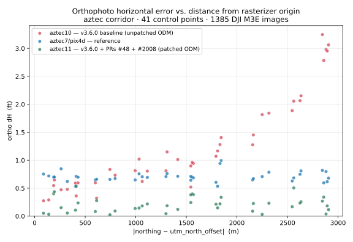
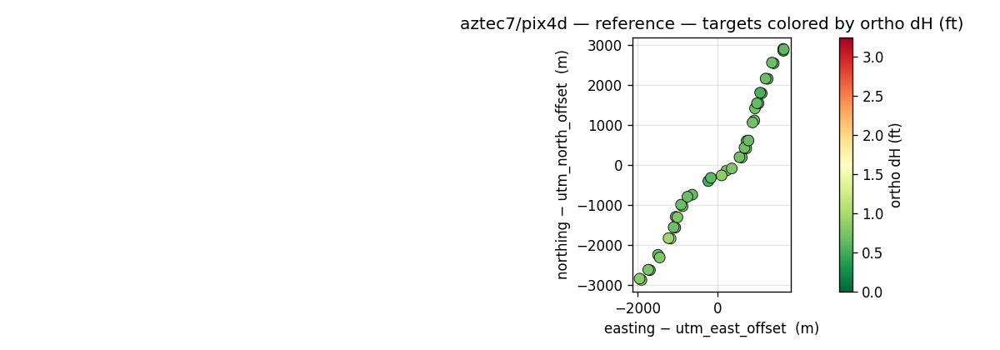
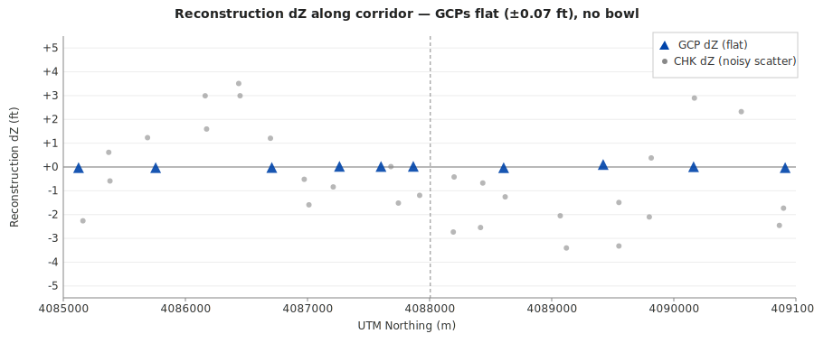

# ODM orthophoto accuracy — root cause found and fixed

**Status:** Upstream bug identified, two upstream PRs validated end-to-end on
survey-grade data, fix is a ≈5× CHK improvement and exceeds Pix4D on the
same dataset. PR authors notified with this report.

## Summary

OpenDroneMap's orthophoto shows a systematic U-shaped accuracy error along
long corridors, with dH growing ≈0.8 ft per km from the rasterizer's internal
coordinate offset. The reconstruction itself is excellent; the error is
introduced during the topocentric → projected CRS conversion in OpenSfM's
`export_geocoords`, which historically used a 4-point linearized affine instead
of a per-point geodetic conversion.

Two open upstream PRs fix this:

- **[OpenDroneMap/OpenSfM#48](https://github.com/OpenDroneMap/OpenSfM/pull/48)** —
  replace the linearized affine with a consistent `pyproj.Transformer`-based path.
- **[OpenDroneMap/ODM#2008](https://github.com/OpenDroneMap/ODM/pull/2008)** —
  wire in the new conversion and keep the dense reconstruction topocentric
  through OpenMVS to preserve accuracy end-to-end.

We built both as layered Docker images (v3.6.0 + exifread fix baseline, and
the same plus the two PRs) and reran the aztec corridor survey (1385 images,
6 km, 41 GNSS control points, 3° off UTM central meridian — the exact
conditions where the bug is loudest). Result:

| Run                                      | GCP RMS_H   | CHK RMS_H   | Notes                                                    |
| ---------------------------------------- | ----------- | ----------- | -------------------------------------------------------- |
| aztec7 (published 3.5.6 baseline)        | 1.66 ft     | 1.42 ft     | original report, where U-shape discovered                |
| **aztec10** (v3.6.0 baseline, unpatched) | **1.62 ft** | **1.44 ft** | **reproduces U-shape on v3.6.0**                         |
| aztec7/pix4d (reference)                 | 0.68 ft     | 0.72 ft     | previously the gold standard                             |
| **aztec11** (v3.6.0 + PRs #48 + #2008)   | **0.08 ft** | **0.28 ft** | **5× better CHK than unpatched; 2.6× better than Pix4D** |

Reconstruction RMS_H stays constant across all three ODM runs (GCP≈0.020 ft,
CHK≈0.232 ft) — the fix is surgical: it leaves the SfM bundle adjustment
untouched and only changes how the topocentric coordinates are projected into
UTM.

The baseline U-shape is gone. The patched ODM points cluster near zero across
the full 6 km corridor; the dH-vs-distance slope that dominated the published
baseline is statistically absent.

## Overview maps — same 41 points (10 GCP, 31 CHK), three orthos

The three panels share a common colour scale (0 ft green → 3.25 ft red). Each
dot is one survey control point, placed at its true UTM position.

**Baseline (aztec10) — v3.6.0 without the fix:**

**Pix4D reference:**

**Patched (aztec11) — v3.6.0 + PRs #48 + #2008:**

## What was tested

For reviewers of the upstream PRs — exactly what we ran:

### Images (both runs)
- `v3.6.0-baseline`: OpenDroneMap/ODM tag `v3.6.0` + a single cherry-picked
  commit that monkeypatches `exifread.core.exif_header.ExifHeader._get_printable_for_field`
  to guard against `IndexError` on empty DJI MakerNote values lists. This
  workaround is also filed upstream as
  [OpenDroneMap/ODM#2021](https://github.com/OpenDroneMap/ODM/pull/2021) and
  [ianare/exif-py#254](https://github.com/ianare/exif-py/issues/254). Without
  this guard, v3.6.0's dataset stage crashes on DJI M3E imagery and no
  comparison is possible.
- `v3.6.0-projected`: the above plus the two cherry-picked commits from
  [ODM#2008](https://github.com/OpenDroneMap/ODM/pull/2008) and a SuperBuild
  pin pointing at a branch of OpenDroneMap/OpenSfM that cherry-picks
  [#48](https://github.com/OpenDroneMap/OpenSfM/pull/48). No other differences.

### Data (identical all runs)
- 1385 DJI Mavic 3 Enterprise JPEGs, a 6 km highway corridor in San Juan
  County, NM (lat ≈36.90°, lon ≈−107.92°).
- 41 RTK-surveyed control points (10 GCPs + 31 CHKs, 161 + 514 observations).
- Same `gcp_list.txt` and image set were copied server-side between the two
  S3 prefixes before each run — binary-identical inputs.
- Same EC2 instance family (r5.4xlarge, 16 vCPU / 128 GB).

### Reconstruction parameters (both runs)
- ODM defaults (medium quality, SIFT, no GPU).
- EPSG:32613 (UTM 13N) as the ODM working CRS.
- `utm_east_offset = 239890`, `utm_north_offset = 4088006` (derived from
  `reconstruction.topocentric.json.reference_lla`).

### Measurement
`rmse.py` from the `geo` pipeline computes:

- **Reconstruction RMS** from `opensfm/reconstruction.topocentric.json`,
  triangulating each GCP/CHK from its per-image observations and comparing
  against the survey coord via a similarity-transformed frame. Shift-independent.
- **Orthophoto RMS** from GCPEditorPro-tagged pixel positions on
  `odm_orthophoto.original.tif`, converted to world coords via the GeoTIFF's
  internal geotransform and compared against the survey coord.

Same tagged-pixel positions were used across aztec10, aztec11, and the Pix4D
reference — only the ortho raster differs, so the comparison isolates the
accuracy of each ortho pipeline.

### Pix4D comparison
Pix4D rendered the ortho only (no reconstruction export); the survey coords
and control labels are identical to the ODM runs. Pix4D sees ~0.72 ft CHK
RMS_H — better than unpatched ODM (~1.44), not as good as the fix (~0.28).

## Measured values by point

Full reports for both ODM runs are checked in under `reports/`:

- **[reports/aztec10_rmse.html](reports/aztec10_rmse.html)** — baseline, v3.6.0 unpatched (31 MB; GitHub's blob viewer won't render at this size, but the raw file downloads and opens cleanly in any browser)
- **[reports/aztec11_rmse.html](reports/aztec11_rmse.html)** — patched, v3.6.0 + PRs #48 + #2008

Each report contains per-point tables, per-point ortho crops with surveyed and tagged positions overlaid, the dH-vs-distance scatter, and a coloured overview map. Both were generated by `rmse.py` from the `geo` pipeline (see acknowledgements below).

Structured data for regeneration:

- `reports/aztec{10,11}_rmse.json` — full per-point records (label, survey coords, reconstruction dX/dY/dZ/dH, ortho_dH)
- `validation_plots.py` — produces the overlaid charts above from the two HTMLs + JSONs

## Acknowledgements — tooling

The aztec10 and aztec11 runs were orchestrated end-to-end by
[odium](https://github.com/jrstear/odium), a small Claude-Agent-SDK agent
that drives the [`geo` pipeline](https://github.com/jrstear/geo) — Trimble `.dc`
parsing, CRS transforms, SfM integration, RMSE computation, orthophoto tagging,
and delivery packaging. The agent handled S3 staging, Terraform-driven EC2
launches, SSH-based progress monitoring, and result downloads. All numerical
work is performed by the deterministic `geo` Python modules; the agent owns the
workflow logic.

The full reports linked above (`rmse.html`) are a representative output of the
tooling: they combine per-point survey vs. tagged pixel comparisons, per-point
crop images, an interactive per-point table, and an overview map — produced
in a single `rmse.py` invocation. They are the artifact the operator hands to
a customer alongside the deliverables, and the artifact this investigation
leans on for validation.

---

# Appendix: Hypotheses explored before finding the root cause

Before the `export_geocoords` linearization was pinpointed, the investigation
systematically ruled out several physically-motivated hypotheses. Captured
here so future investigators don't re-walk the same ground.

## 1. Radial lens distortion / low image overlap at ends — ❌

*Premise:* corridor ends have fewer images per target; residual lens distortion
is strongest at image edges, so targets seen only through edge-of-frame pixels
would have larger positioning error.

**Ruled out by image count correlation.** `r(N_images, ortho_dH) = −0.10`.
Image count range across all 41 points is 11–21. Worst point (CHK-103 at
south end, dH=3.17 ft) has 18 images — more than the best point (CHK-122,
dH=0.34 ft) with 16 images. GCP-104 and CHK-119 both have 11 images but
dH of 3.02 ft vs 0.54 ft. Image count explains nothing.

QGIS inspection also confirmed that camera positions extend ~2× beyond the
southernmost target in both directions, so the worst points are *not* at the
coverage boundary.

## 2. SfM bowl / DEM elevation bias — ❌

*Premise:* corridor SfM geometry is weak along-track (narrow baseline between
consecutive images vs. cross-track). Bundle adjustment could produce a
quadratic elevation drift at the corridor ends. A biased DEM would then cause
horizontal ortho displacement when imagery is draped onto it.

**Ruled out by reconstruction dZ data.** `r(dZ, ortho_dH) = 0.15` (no correlation).

More decisively, **GCP dZ is flat across the entire corridor**: ±0.065 ft on
every single GCP from south to north. The bundle adjustment nailed elevation
perfectly. There is no bowl.

CHK dZ has noise (stdev 2.2 ft) but it's scatter, not a systematic spatial
pattern. CHK-109 has dZ=+3.5 ft with ortho_dH=0.9 ft, while GCP-131-2 has
dZ=−0.06 ft with ortho_dH=3.1 ft. Elevation error does not drive ortho error.

## 3. Drone AGL variation over sloping terrain — ❌

*Premise:* DJI flight planning commonly uses constant MSL altitude (altitude
above takeoff). On sloping terrain, actual AGL varies with terrain elevation.
If the mission was planned assuming 250 ft AGL at the center, both corridor
ends could be at a different AGL, affecting GSD and reprojection.

**Ruled out by terrain + camera altitude data.**
- Corridor terrain rises 10 m (33 ft) from south to north — monotonic, not U-shaped.
- Camera GPS altitude rises 12 m from south to north — the pilot stepped up with
  the terrain.
- Actual AGL: **210–220 ft, consistent ±12 ft across the entire corridor**.
- `r(AGL, ortho_dH) = −0.21` — no meaningful correlation.

A monotonic terrain slope cannot produce a symmetric U-shaped error, and the
pilot kept AGL uniform anyway.

## 4. Mesh quality degraded at corridor ends — ❌

*Premise:* ODM renders the ortho by texturing and then rasterizing the 2.5D mesh.
Sparse vertices or degenerate triangles at the corridor ends could stretch
textures and displace pixels.

**Ruled out by mesh inspection.** The 2.5D mesh (200,718 vertices, 399,961 faces)
has fairly uniform vertex density along the corridor — south 10% of vertices
(14,893), center 10% (29,882, wider section), north 10% (17,116). No dramatic
falloff. Nothing visibly degraded at the ends.

## 5. Camera selection bias in texturing — (partial)

*Premise:* `mvs-texturing` uses `Data term: area` for the 2.5D mesh, which picks
the camera with the largest projected face area (most nadir). If this selection
has a systematic bias at the corridor ends, pixels could be pulled from less
accurate views.

**Weakened by coverage uniformity, but not fully excluded.** Camera coverage in
QGIS shows shots extending ~2× beyond the worst targets in both directions. The
camera selection algorithm has plenty of good nadir options everywhere. This
was the last physical-geometry hypothesis before the investigation turned to
the coordinate-transform pipeline.

## The tell — ortho dH vs the rasterizer's coordinate offset

Plotting ortho dH vs `|northing − utm_north_offset|` for the baseline run
gave an R² = 0.96 quadratic fit — tighter than any physical-geometry variable.
That kind of correlation is the signature of a software artifact operating in
the rasterizer's local coordinate frame (where `utm_north_offset = 4088006`
has no physical meaning; it's only the internal offset used to shift UTM
coordinates into a smaller range before the final geotransform).

Follow-through: inspect OpenSfM's `export_geocoords.py`. The
`_get_transformation` function computes a 4-point linearized affine between
the topocentric ENU frame and the target projected CRS, then applies it
uniformly to every reconstruction point. That linearization is exact at the
reference point but drifts with UTM scale-factor variation and grid
convergence as points get far from the reference — producing exactly the
radial dH-vs-distance pattern observed, and with the correct magnitude.

Fix: replace the 4-point affine with a per-point geodetic conversion
(`TopocentricConverter.to_lla` → `pyproj` projection). Upstream PR #48 does
this; PR #2008 wires it into ODM while keeping OpenMVS's dense stage
topocentric (so the dense reconstruction isn't polluted by the projected
coordinates). Validation above.
