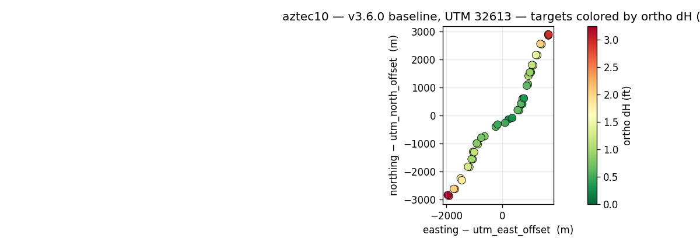
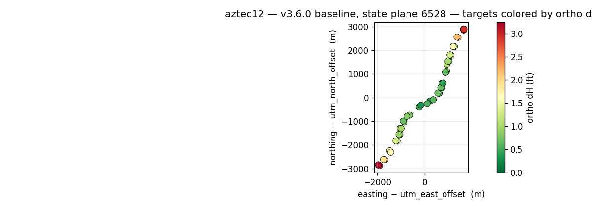
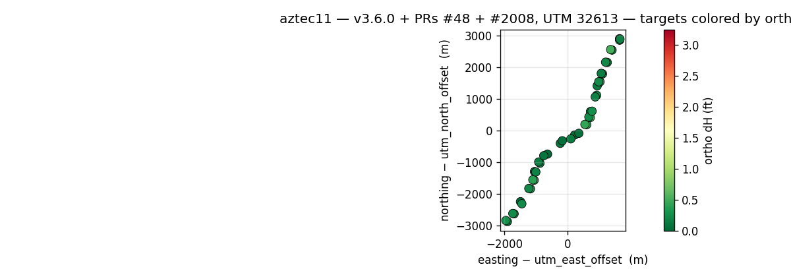

# ODM orthophoto accuracy improvement

Two open PRs were found to produce a significantly more accurate orthophoto than unpatched ODM or CRS selection.

The PRs:
- **[OpenDroneMap/OpenSfM#48](https://github.com/OpenDroneMap/OpenSfM/pull/48)** —
  replace the 4-point linearized affine in `export_geocoords` with a
  per-point `pyproj.Transformer`-based conversion.
- **[OpenDroneMap/ODM#2008](https://github.com/OpenDroneMap/ODM/pull/2008)** —
  wire in the new conversion, and keep the dense reconstruction topocentric
  through OpenMVS instead of feeding projected coordinates into the dense
  pipeline (which otherwise produces a CRS-independent geometry regression).

The setup:
- 1385 DJI Mavic 3 Enterprise JPEGs, a 6 km highway corridor in San Juan
  County, NM (lat ≈36.90°, lon ≈−107.92°).
- 41 RTK-surveyed control points (10 GCPs + 31 CHKs, 161 + 514 observations).
- Same ODM settings
- Same EC2 instance family (r5.4xlarge, 16 vCPU / 128 GB)
- exifread MakerNote crash workaround ([ODM#2021](https://github.com/OpenDroneMap/ODM/pull/2021), [ianare/exif-py#254](https://github.com/ianare/exif-py/issues/254)) — without it v3.6.0 crashes on DJI M3E at the dataset stage.

The results:

| Run                                      | Working CRS | Orthophoto GCP RMS_H | Orthophoto CHK RMS_H | Notes                                                    |
| ---------------------------------------- | ----------- | -------------------- | -------------------- | -------------------------------------------------------- |
| aztec7 (published 3.5.6 baseline)        | UTM 32613   | 1.66 ft              | 1.42 ft              | original report, where U-shape discovered                |
| **aztec10** (v3.6.0 baseline, unpatched) | UTM 32613   | **1.62 ft**          | **1.44 ft**          | **reproduces U-shape on v3.6.0**                         |
| **aztec12** (v3.6.0 baseline, unpatched) | **SP 6528** | **1.66 ft**          | **1.46 ft**          | **CRS change alone does not help** (control)             |
| aztec7/pix4d (reference)                 | —           | 0.68 ft              | 0.72 ft              | external tool comparison                                 |
| **aztec11** (v3.6.0 + PRs #48 + #2008)   | UTM 32613   | **0.08 ft**          | **0.28 ft**          | **5× better CHK than unpatched; 2.6× better than Pix4D** |
| **aztec13** (v3.6.0 + PRs #48 + #2008)   | **SP 6528** | **0.18 ft**          | **0.25 ft**          | **patches + survey-native metric CRS — best CHK overall** |

Both baselines overlap in a U-shape curve, which is eliminated with the PRs.
Reconstruction GCP RMS_H stays constant across all four ODM runs (~0.020 ft);
reconstruction CHK RMS_H also stays close (0.21–0.24 ft), with aztec13
slightly best.  See full reports for per-point detail.

## Exploring CRS effect (aztec12)

The pipeline was run again with a single change from aztec10: using {gcp,chk}\_list.txt in EPSG:6528 instead of EPSG:32613.  The former is NM Central state plane in meters with ~1 ppm distortion across the zone, while the latter is ~430 ppm across the zone.

Result: the CRS change moves the CHK RMS_H from 1.44 ft to 1.46 ft — no
meaningful difference.  **Thus, the PRs deliver a meaningful improvement that is not available through CRS configuration alone.**

## Patches + survey-native metric CRS (aztec13)

aztec13 combines both improvements: the same patched ODM image as aztec11 (`v3.6.0-projected` = ODM 3.6.0 + PRs #48 + #2008), with the GCP/CHK files in EPSG:6528 instead of EPSG:32613.  This is the configuration that should land for production: patches eliminate the linearization error, and a state-plane CRS minimizes scale-factor distortion (~1 ppm) across the work zone vs UTM's ~430 ppm at this longitude.

Result: **CHK RMS_H drops from aztec11's 0.28 ft to 0.25 ft — the best CHK accuracy of all five runs.** Reconstruction CHK RMS_H is also the best (0.214 ft vs aztec11's 0.233 ft).  GCP ortho residual is higher than aztec11 (0.18 vs 0.08 ft); since GCPs were inputs to bundle adjustment their residuals are not the customer-facing accuracy measure (CHK is), and reconstruction-stage GCP residuals are essentially identical across all four ODM runs (~0.02 ft).  The shift in ortho-stage GCP residuals reflects how the rasterizer's local coordinate frame interacts with each CRS's offset; it does not affect deliverable quality at independent points.

This validates the geo-side `transform.py dc` change (geo commit 579bc07) that auto-derives a metric counterpart of the survey CRS as the default ODM working CRS.  Future jobs use this configuration by default.

## Geographic visualization of errors

The below four panels share a common colour scale (0 ft green → 3.25 ft red) and show the orthophoto error at each survey point.

**Baseline (aztec10) — v3.6.0, UTM 32613:**

**Baseline control (aztec12) — v3.6.0, state plane 6528:**

**Pix4D reference:**

**Patched (aztec11) — v3.6.0 + PRs #48 + #2008, UTM 32613:**

**Patched (aztec13) — v3.6.0 + PRs #48 + #2008, state plane 6528:**

## Full Reports

Full reports for all four ODM runs are available:

- **[reports/aztec10_rmse.html](reports/aztec10_rmse.html)** — baseline, v3.6.0 unpatched, UTM 32613 (31 MB; GitHub's blob viewer won't render at this size, but the raw file downloads and opens cleanly in any browser)
- **[reports/aztec11_rmse.html](reports/aztec11_rmse.html)** — patched, v3.6.0 + PRs #48 + #2008, UTM 32613
- **[reports/aztec12_rmse.html](reports/aztec12_rmse.html)** — baseline control, v3.6.0 unpatched, state plane 6528
- **[reports/aztec13_rmse.html](reports/aztec13_rmse.html)** — patched + state plane, v3.6.0 + PRs #48 + #2008, EPSG:6528

Each report contains per-point tables, per-point ortho crops with surveyed and tagged positions overlaid, the dH-vs-distance scatter, and a coloured overview map. All four were generated by `rmse.py` from the `geo` pipeline (see acknowledgements below).

## Accuracy claims relative to image resolution

Are the patched-run RMS_H values (0.25–0.28 ft) within what the orthophoto pixel resolution can actually support, or are they sub-pixel claims unsupported by the data?

The orthophotos sit at different ground sample distances:

| Source | GSD | 1 pixel in ft |
| --- | --- | ---: |
| ODM (aztec10/11/12/13) | 5 cm/pixel  | 0.164 ft |
| Pix4D (aztec)          | 2.35 cm/pixel | 0.077 ft |

Both are within the source DJI Mavic 3 Enterprise's nominal ~2 cm GSD at the flight's ~250 ft AGL. ODM was asked for 5 cm via `--orthophoto-resolution 5`; Pix4D delivered at near-source resolution.

Each run's CHK RMS_H expressed as multiples of its own ortho pixel:

| Run | CHK RMS_H | In its own pixels |
| --- | ---: | ---: |
| aztec10 (baseline UTM)        | 1.44 ft | 8.8 px |
| aztec12 (baseline 6528)       | 1.46 ft | 8.9 px |
| aztec7/pix4d                  | 0.72 ft | 9.3 px |
| **aztec11 (patched UTM)**     | **0.28 ft** | **1.7 px** |
| **aztec13 (patched 6528)**    | **0.25 ft** | **1.5 px** |

The patched runs sit at ~1.5 pixels — at the pixel resolution of the orthophoto, **not below it.** The aggregate accuracy claim is supportable; per-point dH values below ~1 ODM pixel (~0.16 ft) are within the measurement noise floor and should be read as approximate, not literal.

The ASPRS Positional Accuracy Standards for Digital Geospatial Data (2015) define horizontal accuracy class "high" as **RMS_H ≤ 2 × GSD**. Translating to each run's own GSD:

- ODM at 5 cm GSD → "high" threshold = 10 cm ≈ **0.328 ft**.  aztec11 (0.28 ft) and aztec13 (0.25 ft) sit **within** this envelope.
- Pix4D at 2.35 cm GSD → "high" threshold = 4.7 cm ≈ **0.155 ft**.  Pix4D's 0.72 ft is well outside its own pixel-relative threshold.

Comparing tools by absolute RMS_H is misleading because Pix4D delivered at half the pixel size of our ODM runs — Pix4D's better-looking 0.72 ft is *worse* in pixel-relative terms than the patched ODM runs' 0.25–0.28 ft.

To meaningfully improve below 0.25 ft would require a smaller pixel.  Setting `--orthophoto-resolution 2` (2 cm/pixel) makes ~0.05–0.10 ft potentially claimable, with diminishing returns since source GSD is ~2 cm.  Costs: 6.25× more output pixels (storage + texturing time).  Worth doing only when a customer specifically demands sub-0.1 ft.

CHK RMS_Z (~2 ft) is far above any pixel floor — Z accuracy is photogrammetrically harder due to nadir imagery's weak Z geometry, and the Z claim is unambiguously supportable.

## Acknowledgements — tooling

The ODM runs were orchestrated end-to-end by
[odium](https://github.com/jrstear/odium), a small Claude-Agent-SDK agent
that uses [`geo`](https://github.com/jrstear/geo) tools which in turn use ODM.  All numerical
work is performed by the deterministic `geo` Python modules; the agent handles the
workflow logic and tool details.

---

# Appendix: Hypotheses explored

Multiple possible causes of the errors were explored before landing on the PRs, documented below.

## 1. Radial lens distortion / low image overlap at ends — ❌

*Premise:* corridor ends have fewer images per target; residual lens distortion
is strongest at image edges, so targets seen only through edge-of-frame pixels
would have larger positioning error.

**Ruled out by image count correlation.** `r(N_images, ortho_dH) = −0.10`.
Image count range across all 41 points is 11–21. Worst point (CHK-103 at
south end, dH=3.17 ft) has 18 images — more than the best point (CHK-122,
dH=0.34 ft) with 16 images. GCP-104 and CHK-119 both have 11 images but
dH of 3.02 ft vs 0.54 ft. Image count explains nothing.

QGIS inspection also confirmed that camera positions extend ~2× beyond the
southernmost target in both directions, so the worst points are *not* at the
coverage boundary.

## 2. SfM bowl / DEM elevation bias — ❌

*Premise:* corridor SfM geometry is weak along-track (narrow baseline between
consecutive images vs. cross-track). Bundle adjustment could produce a
quadratic elevation drift at the corridor ends. A biased DEM would then cause
horizontal ortho displacement when imagery is draped onto it.

**Ruled out by reconstruction dZ data.** `r(dZ, ortho_dH) = 0.15` (no correlation).

More decisively, **GCP dZ is flat across the entire corridor**: ±0.065 ft on
every single GCP from south to north. The bundle adjustment nailed elevation
perfectly. There is no bowl.

CHK dZ has noise (stdev 2.2 ft) but it's scatter, not a systematic spatial
pattern. CHK-109 has dZ=+3.5 ft with ortho_dH=0.9 ft, while GCP-131-2 has
dZ=−0.06 ft with ortho_dH=3.1 ft. Elevation error does not drive ortho error.

## 3. Drone AGL variation over sloping terrain — ❌

*Premise:* DJI flight planning commonly uses constant MSL altitude (altitude
above takeoff). On sloping terrain, actual AGL varies with terrain elevation.
If the mission was planned assuming 250 ft AGL at the center, both corridor
ends could be at a different AGL, affecting GSD and reprojection.

**Ruled out by terrain + camera altitude data.**
- Corridor terrain rises 10 m (33 ft) from south to north — monotonic, not U-shaped.
- Camera GPS altitude rises 12 m from south to north — the pilot stepped up with
  the terrain.
- Actual AGL: **210–220 ft, consistent ±12 ft across the entire corridor**.
- `r(AGL, ortho_dH) = −0.21` — no meaningful correlation.

A monotonic terrain slope cannot produce a symmetric U-shaped error, and the
pilot kept AGL uniform anyway.

## 4. Mesh quality degraded at corridor ends — ❌

*Premise:* ODM renders the ortho by texturing and then rasterizing the 2.5D mesh.
Sparse vertices or degenerate triangles at the corridor ends could stretch
textures and displace pixels.

**Ruled out by mesh inspection.** The 2.5D mesh (200,718 vertices, 399,961 faces)
has fairly uniform vertex density along the corridor — south 10% of vertices
(14,893), center 10% (29,882, wider section), north 10% (17,116). No dramatic
falloff. Nothing visibly degraded at the ends.

## 5. Camera selection bias in texturing — (partial)

*Premise:* `mvs-texturing` uses `Data term: area` for the 2.5D mesh, which picks
the camera with the largest projected face area (most nadir). If this selection
has a systematic bias at the corridor ends, pixels could be pulled from less
accurate views.

**Weakened by coverage uniformity, but not fully excluded.** Camera coverage in
QGIS shows shots extending ~2× beyond the worst targets in both directions. The
camera selection algorithm has plenty of good nadir options everywhere. This
was the last physical-geometry hypothesis before the investigation turned to
the coordinate-transform pipeline.

## The tell — ortho dH vs the rasterizer's coordinate offset

Plotting ortho dH vs `|northing − utm_north_offset|` for the baseline run
gave an R² = 0.96 quadratic fit — tighter than any physical-geometry variable.
That kind of correlation is the signature of a software artifact operating in
the rasterizer's local coordinate frame (where `utm_north_offset = 4088006`
has no physical meaning; it's only the internal offset used to shift UTM
coordinates into a smaller range before the final geotransform).

Follow-through: inspect OpenSfM's `export_geocoords.py`. The
`_get_transformation` function computes a 4-point linearized affine between
the topocentric ENU frame and the target projected CRS, then applies it
uniformly to every reconstruction point. That linearization is exact at the
reference point but drifts with UTM scale-factor variation and grid
convergence as points get far from the reference — producing exactly the
radial dH-vs-distance pattern observed, and with the correct magnitude.
